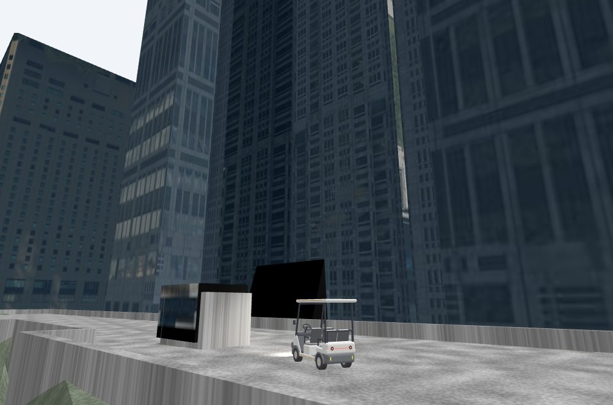
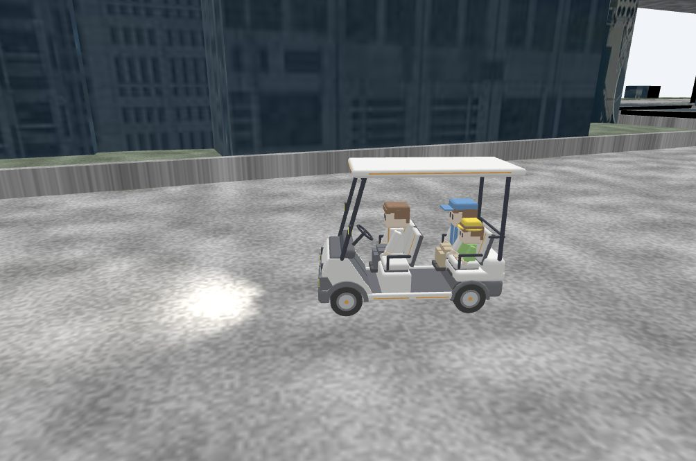
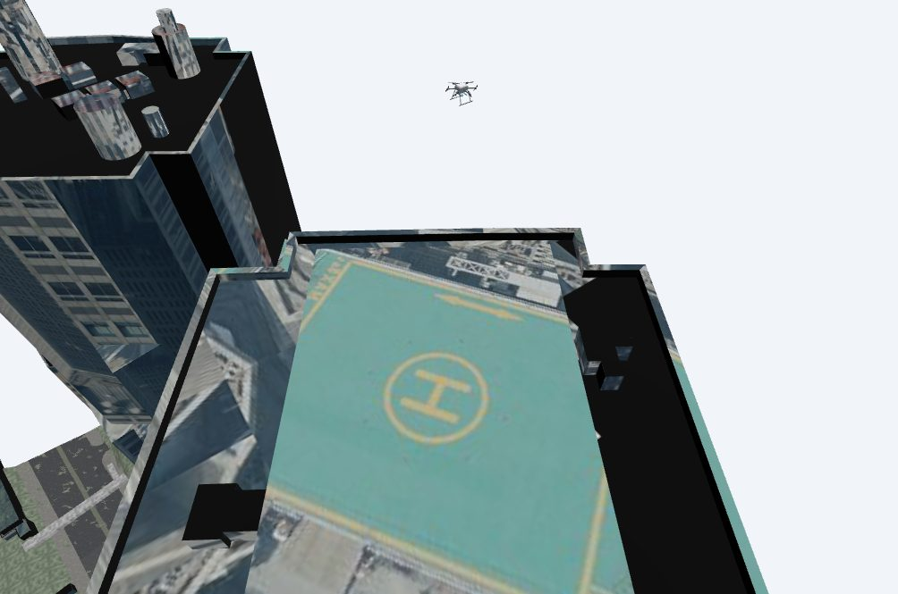
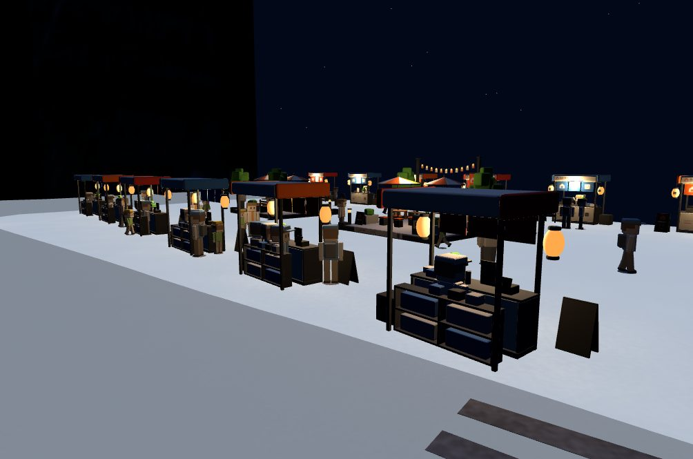
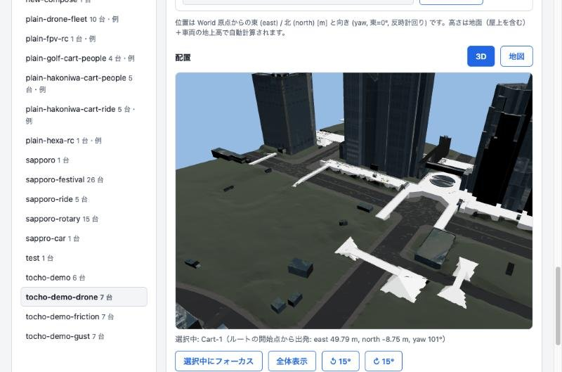

# Hakoniwa Urban Mobility

Cars, carts, drones and people in one PLATEAU city, simulated in real time and
watched from any browser on the network.



| | |
|---|---|
|  |  |
|  |  |

Hakoniwa Urban Mobility puts existing Hakoniwa simulators into the same city:

- **Cities** from [PLATEAU](https://www.mlit.go.jp/plateau/) 3D city models (or
  OpenStreetMap), made in [Hakoniwa Environment
  Studio](https://github.com/hakoniwalab/hakoniwa-environment-studio): buildings,
  roads, bridges and terrain with their collision shapes, plus stalls, stops
  and road surfaces (dry, wet, snow, ice).
- **Vehicles**: Golf Carts and Hakoniwa Carts and Cars (MuJoCo, driven by route
  scenarios or a game pad), EAMS Hexa and FPV drones (Hakoniwa Drone Core,
  flown by a flight plan or a game pad), and Drone Core fleets.
- **Hakoniwa People** who walk, wait at stops and ride the carts.
- **Urban Studio**, a browser UI to compose a scene (city, vehicles, routes,
  flights), run it at real time and open the 3D viewer, from the same PC or
  from a phone or another PC on the network.

It composes the vehicle simulators; it does not replace their vehicle models,
flight controllers or physics engines.

## Try these first

| Scene | What you see | Composition |
|---|---|---|
| Tokyo Metropolitan Government Building, carts and people | Hakoniwa Carts carry people over the pedestrian deck while a Hakoniwa Car runs on the road below | `showcase-tocho-cart-people` |
| Tokyo Metropolitan Government Building, drone | An EAMS Hexa takes off from the rooftop heliport and flies its flight plan around the towers | `showcase-tocho-drone` |
| Sapporo Station, food stalls on a snowy night | A Hakoniwa Cart brings people from the station to twelve lit stalls and a busy square | `showcase-sapporo-stalls-night` |

In Urban Studio: **Simulation** tab, pick the Composition, then Configure,
Start, and open the Viewer.

## Run it

### Windows: the portable package (no installation)

1. Download `hako-urban-studio-win64.zip` from
   [Releases](https://github.com/hakoniwalab/hakoniwa-urban-mobility/releases).
2. Extract it to a short folder of letters and digits only, for example
   `C:\hako` (no spaces, no Japanese).
3. Double-click `start-urban-studio.bat`. Urban Studio opens in the browser
   with the three scenes above.
4. `stop-urban-studio.bat` stops everything.

Windows 11 x64 and an internet connection (map tiles and the viewer's
libraries) are needed. See `README-WINDOWS.txt` in the package for details
and troubleshooting, and [`docs/windows-portable.md`](docs/windows-portable.md)
to build the package yourself.

### macOS / Linux: the Business Pack Workspace

1. Set up [Hakoniwa Business Pack](https://github.com/hakoniwalab/hakoniwa-business-pack)
   and clone this repository next to it.
2. In the Workspace shell (`python tools/workspace.py enter`, in
   `hakoniwa-business-pack`), make the cities and copy the scenes (PLATEAU data
   is downloaded the first time):

   ```bash
   python ../hakoniwa-urban-mobility/tools/urban_demo_worlds.py build --showcase --tocho --sapporo
   python ../hakoniwa-urban-mobility/tools/urban_studio.py start --open-browser
   ```

3. `python ../hakoniwa-urban-mobility/tools/urban_studio.py stop` when done.

The step-by-step guide (日本語), including making your own city, is
[`docs/quickstart-ja.md`](docs/quickstart-ja.md). The cities are made again
from text (request JSON and Recipe YAML), so nothing large is stored in this
repository.

## Viewing and verified environments

The simulation itself (MuJoCo plants, Drone services, WebBridge) runs on the
CPU and needs no GPU. The viewer is a WebGL page in the browser, and drawing a
PLATEAU City World is GPU-heavy.

| Machine | CPU / memory | GPU | OS | Browser | Verified (2026-10) |
|---|---|---|---|---|---|
| MacBook Pro (Mac14,9) | Apple M2 Pro, 12 cores / 32 GB | M2 Pro, 19 cores | macOS 27.0.1 | Chrome 154 | Car, Drone and integrated demos at RTF 1.0 |
| Notebook (MouseComputer S4I7G60SRDDC) | Intel Core Ultra 7 155H, 22 threads / 64 GB | Intel Arc (integrated) + NVIDIA GeForce RTX 4060 Laptop | Windows 11 Pro 25H2 | Chrome 154 on the RTX 4060 | Car and Drone demos 3-1 to 3-5 at RTF 1.0, from the repository and from the portable package |
| iPhone (compact model), as a remote browser | – | – | latest iOS (2026-10) | browser on the phone | Urban Studio operated and the Viewer opened over Wi-Fi, smooth at RTF 1.0 with the simulation on the MacBook Pro |

**Recommended: operate and view from another device.** Urban Studio
(28090), the viewer's HTTP server (28100) and the WebBridge (28865-28867)
listen on every address, so a PC or a phone on the same subnet can use
them (tablets untested); the simulation host needs no browser. A typical
field setup runs the simulation on a Windows PC and operates Urban Studio from a Mac (or the other
way round):

- Urban Studio: open `http://<simulation-host>:28090/` (`urban_studio.py start`
  prints this URL). The Viewer links it shows point at the same host.
- Viewer: in the Simulation tab, "スマホ・別の PC で見る" shows the Viewer's
  URL on the local network and a QR code for a phone. Any viewer URL printed by
  `configure` also works with `127.0.0.1` replaced by the host's address; the
  page connects to the WebBridge on the host it was loaded from (an explicit
  `?wsUri=` still wins).
- Environment Studio (28097) still listens on `127.0.0.1` only: make new
  Cities on the simulation host.

Anyone who reaches these ports can run and stop simulations and read the
workspace folder the viewer serves, so use a trusted network and allow the
ports only for the local subnet. On Windows, run in an administrator
PowerShell (remove the rule when no longer needed):

```powershell
New-NetFirewallRule -DisplayName "Hakoniwa Urban (LAN)" -Direction Inbound -Protocol TCP `
  -LocalPort 28090,28100,28865-28867 -RemoteAddress LocalSubnet -Action Allow -Profile Any
Remove-NetFirewallRule -DisplayName "Hakoniwa Urban (LAN)"
```

`-RemoteAddress LocalSubnet` admits only devices on the same subnet; `-Profile
Any` is needed because Windows often classifies a home or office network as
Public. On macOS, allow incoming connections for the Foundation Python and
`hakoniwa-pdu-web-bridge` when the firewall asks (it is off by default).

**Viewing on the same PC: put the browser on the high-performance GPU.** On a
notebook with two GPUs, Windows runs the browser on the integrated one by
default. Drawing the City World then saturates it, and the simulation on the
same chip falls behind in bursts: the viewer stutters every 1-3 s although
RTF stays 1.0, and other browsers watching the same simulation stutter too.
Measured on the Windows notebook above (park-street demo, 8 m/s, 10 s):

| Browser rendering on | GPU load | WebBridge gaps over 70 ms | Longest gap |
|---|---|---|---|
| no browser | 12 % | 0 | 41 ms |
| integrated Intel Arc | 97 % | 10-14 | 233-300 ms |
| NVIDIA RTX 4060 | 31 % (Arc 19 %) | 0 | 41-45 ms |

On Windows: Settings > System > Display > Graphics, choose the browser,
Options > High performance (the discrete GPU), then restart the browser
(`chrome://gpu` shows the GPU in use). The simulation settings stay the same
on every OS: the stutter was not the simulation's time steps, and changing
them (for example the Conductor `max_delay` or the pacer step) changes how the
vehicles behave.

The step-by-step migration to the managed Business Pack Recipe/Foundation
contract is tracked in
[`docs/foundation-task.md`](docs/foundation-task.md).
The target ownership and lifecycle contract is defined in
[`docs/foundation-contract.md`](docs/foundation-contract.md).

## Status

- Runs at real time (RTF 1.0) on macOS and Windows 11, from the repository and
  from the Windows portable package.
- Not yet: collision avoidance between route Cars (crossing routes can
  collide), and Drone-Car contact beyond the one-way Drone Mirror.

## Documentation

| | |
|---|---|
| [docs/quickstart-ja.md](docs/quickstart-ja.md) | Getting started (日本語): Urban Studio, a plain World, your own PLATEAU city |
| [docs/reference.md](docs/reference.md) | Command-line operation: Compositions, Urban Studio, managed Recipes, People, building the Urban Car |
| [docs/design.md](docs/design.md) | Design notes: architecture, ownership, coordinates, interactions |
| [docs/asset-contract.md](docs/asset-contract.md) | The Composition and Asset contract |
| [docs/urban-manifest.md](docs/urban-manifest.md) | The repository manifest and its ports |
| [docs/windows-portable.md](docs/windows-portable.md) | Building the Windows portable package (日本語) |
| [demos/README.md](demos/README.md) | Optional: the detailed verification demos (wind, falls, friction), made again from text (日本語) |
| [docs/foundation-contract.md](docs/foundation-contract.md) | The Business Pack Recipe and Foundation contract |
